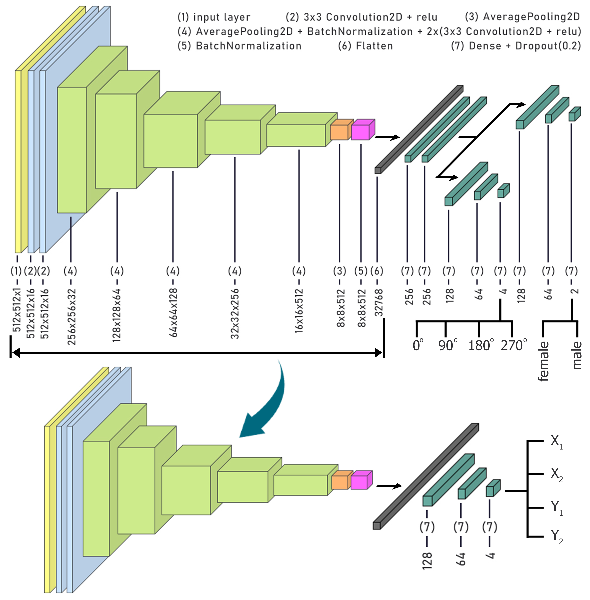
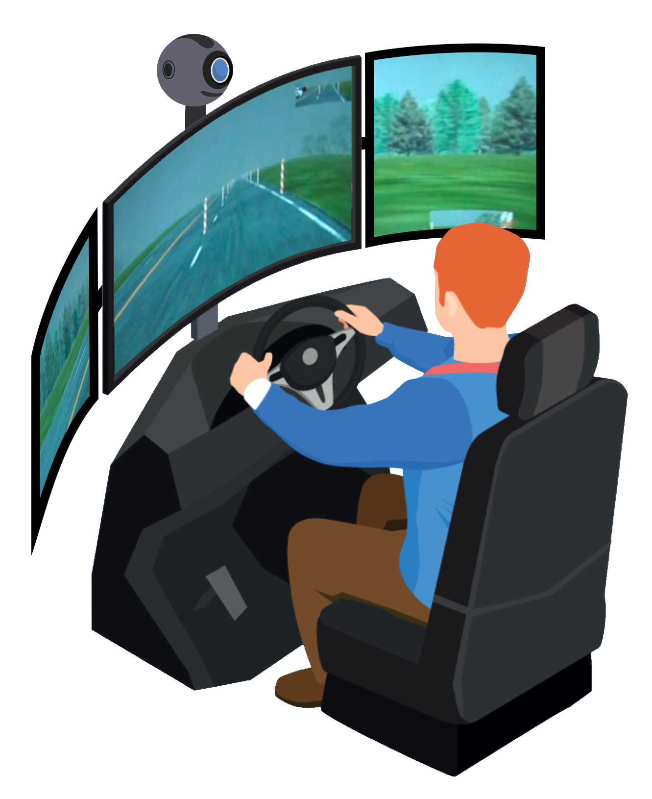

# Driver-s-Distraction-By-Deep-Learning
Recognition Of Driver's Distraction Based On Facial Thermal Videos By Deep Learning 




## Table of Contents
1. [Folder Structure](#folder-structure)
2. [Project Description](#project-description)
3. [Dataset](#dataset)
4. [Results](#results)
5. [Citation](#Citation)
6. [License](#license)


## Folder Structure

- **Src:**
  - Contains folders for 3D CNN, CNN-RNN (main), and Transformer-based codes.


## Project Description

Distraction detection is a crucial method for ensuring drivers' safety. In this study, facial thermal video serves as a non-contact measurement for distraction detection. The project is divided into three key phases:

* Face Tracking with Self-Supervised Learning: In the initial step, faces are tracked in all video frames using a novel self-supervised learning method. Two auxiliary tasks, gender, and rotation detection, are designed to train a deep neural network in a multi-task manner. This model learns general features of faces in an unsupervised approach and is fine-tuned for face tracking.

* Distraction Detection with CNN-RNN: In the final stage, distraction is detected using a CNN-RNN network. The model achieved exceptional performance, with 100% accuracy for gender detection, 98.46% for rotation detection, and an accuracy rate of 91.68% in identifying the presence or absence of a distraction factor. Our proposed face tracker outperforms classical image processing methods for thermal face tracking.

This non-contact distraction detection system, the first to extract features from the entire facial area using a deep learning model, holds significant value in practical applications.


## Dataset

We utilized a multimodal dataset acquired in a controlled experiment on a driving simulator. The dataset includes data for n=68 volunteers who drove the same highway under four different conditions:

1. No Distraction
2. Cognitive Distraction
3. Emotional Distraction
4. Sensorimotor Distraction

The experiment concluded with a special driving session where all subjects experienced a startle stimulus in the form of unintended acceleration. Half of them were under mixed distraction, and the other half in the absence of a distraction. 



During the experimental drives, key response variables and several explanatory variables were continuously recorded:

* Response Variables:
  - Speed
  - Acceleration
  - Brake Force
  - Steering
  - Lane Position Signals
  

* Explanatory Variables:
  - Perinasal Electrodermal Activity (EDA)
  - Palm EDA
  - Heart Rate
  - Breathing Rate
  - Facial Expression Signals

Additionally, biographical and psychometric covariates, as well as eye tracking data, were obtained. This dataset enables research into driving behaviors under neatly abstracted distracting stressors, accounting for many car crashes. The set can also be used in physiological channel benchmarking and multispectral face recognition.


## Results

In this section, we present the performance and outcomes achieved by our Driver Distraction Detection model.

* Gender and Rotation Detection

  `- Gender Detection: 100% accuracy.`

  `- Rotation Detection: 98.46% accuracy.`


* Distraction Detection

  `- Accuracy Rate: 91.68% in classifying distracted vs. non-distracted states.`

  `- Outperforms previous studies considering more than two distracted factors.`
  
  `- Non-contact distraction detection system.`


Feel free to explore the visualizations, charts, or any additional metrics to gain deeper insights into the model's performance.

* Model Comparison

| Method              | Accuracy |
|---------------------|----------|
| CNN-RNN             | 91.68    |
| Transformer-based  | 82.42    |
| 3D CNN              | 83.67    |

* Comparison with other papers

Comparison of driver distraction detection accuracy in previous studies with the proposed method. (Factors: 1=Physiological, 2=Behavioral, 3=Perinasal signals extracted from thermal videos, 4: Thermal videos, CD=Cognitive distractor Drive, ED=Emotional distractor Drive, MD=sensory-Motor distractor Drive, D=Distracted driver, and ND=No-distracted Drive)

| Classification States     | Method            | Accuracy (%) | Input Variables | Reference                   |
|---------------------------|-------------------|--------------:|-----------------|-----------------------------|
| MD vs. ND                 | Random Forest     |           91   | 1 + 3           | Koohestani et al., 2018    |
| (MD & CD) vs. ND          | Random Forest     |           65   | 1 + 2           | McDonald et al., 2020      |
| (CD, ED & MD) vs. ND       | XGB Algorithm     |        78.36   | 1 + 2 + 3       | Panagopoulos et al., 2019  |
| (CD, ED & MD) vs. ND       | CNN-RNN           |        91.68   | 4               | This study                  |


## Citation

If you use this codebase or find the ideas presented here useful for your work, please cite our paper:

**"Recognition of driver's distraction based on facial thermal videos by deep learning"**

*Authors: P. Aghaomidi, Z. Bahmani, A. Mohammdian*

*Conference: 2022 56th Asilomar Conference on Signals, Systems, and Computers*

*DOI: [10.1109/IEEECONF56349.2022.10051936](https://doi.org/10.1109/IEEECONF56349.2022.10051936)*

```text
P. Aghaomidi, Z. Bahmani and A. Mohammdian, "Recognition of driver's distraction based on facial thermal videos by deep learning," 2022 56th Asilomar Conference on Signals, Systems, and Computers, Pacific Grove, CA, USA, 2022, pp. 811-815, doi: 10.1109/IEEECONF56349.2022.10051936.
```


## License
```
This project is licensed under the MIT License. Please ensure proper attribution as per the citation mentioned above.
```